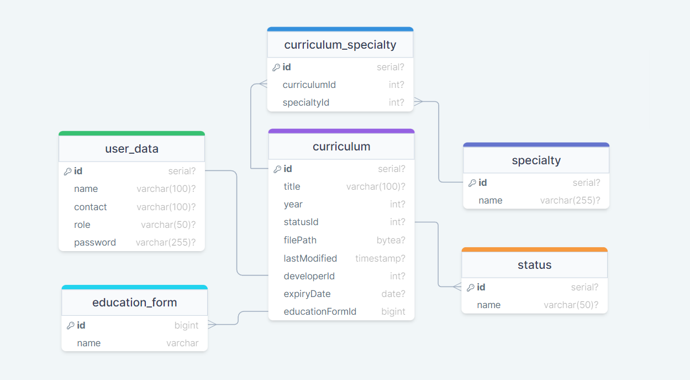

# Запуск докером

docker-compose up --build

> **Это нужно чтобы:** Иинициализировать бд + запустить сервер автоматически(docker-ом).

Есть файл с инициализацие бд: см. sql_init_scripts файл init.sql

# credentials

LOGIN:admin \ user

PASSWORD:manger

# Запуск локально

Запуск: npm start

